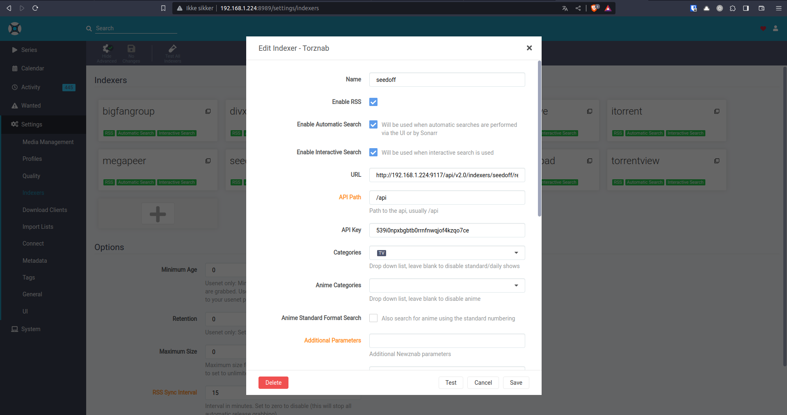
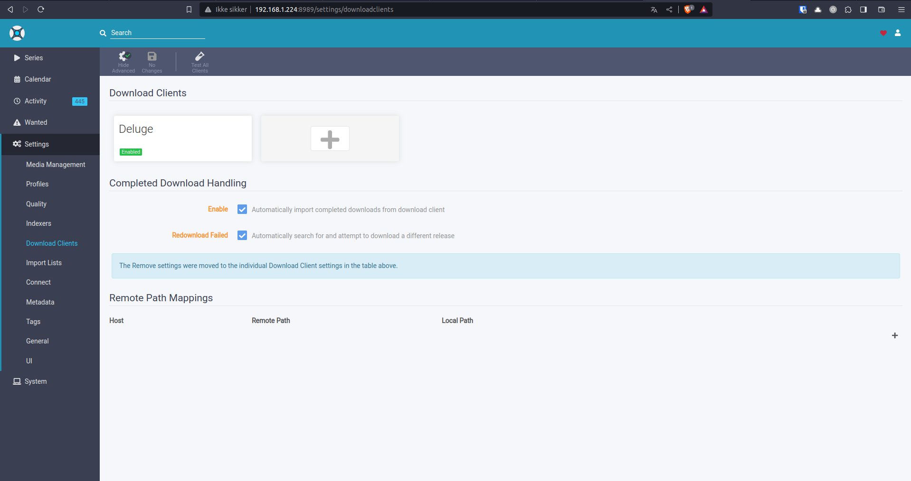
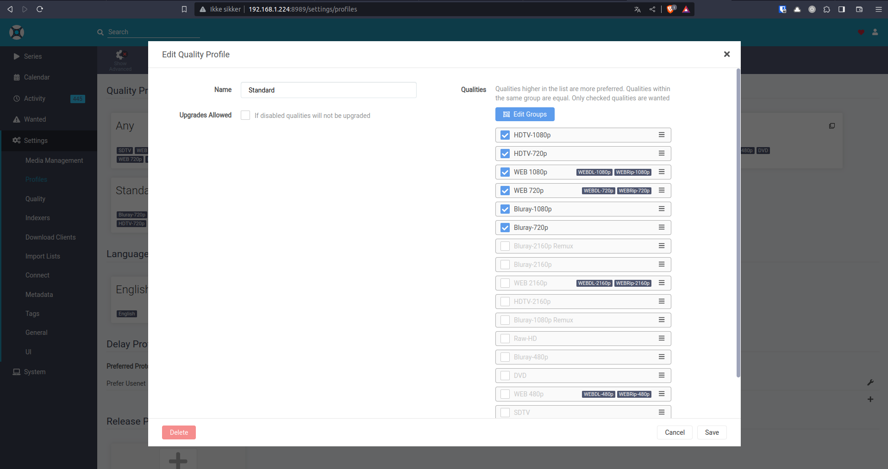

# YT-plex Installation

!!! failure "Root"

    This software has to run as root. ***YOU CAN NOT RUN IT AS A NORMAL USER***.

!!! bug "Important"

    This software is still in development.

    Please report bugs to [Github](https://github.com/RunesRepoHub/YT-Plex/issues)

!!! danger "Docker is required"

    Docker is required to run this software

    [Get Docker on Debian 12](https://linuxiac.com/how-to-install-docker-on-debian-12-bookworm/)

    [Get Docker on Debian 11](https://docs.docker.com/engine/install/debian/)

    [Get Docker on Ubuntu 20.04 and](https://docs.docker.com/engine/install/ubuntu/)


# Install command

## Youtube-dl Performence

!!! danger "Performence"

    The Youtube-dl has some issues when it comes to downloading.
    Mainly because of long playlists and/or multiple downloads running at ones.

    This will result in these errors. (And possible more)

    * Can cause a softlog error on proxmox when running it an VM.

    * The longer the playlists the longer the download. (At download 86 of 156 it takes 30 mins of 400mb of data, THIS is NOT a networking limit)

    * Can cause a but of slow down on plex itself if configured to update library on every change dectected in the folder.


??? success "Install YT-Plex"

    [See the requirements](https://runesrepohub.github.io/YT-Plex/requirement.html)

    Use this command

    ```
    bash <(wget -qO- https://raw.githubusercontent.com/RunesRepoHub/YT-Plex/Production/setup.sh)
    ```
    
    After the install has finished you can use these commands for quick access and control

# Setup jackett indexers

??? tip "From the Jackett page, click the "add indexer" button so that the pop up window with the full list of indexers appears."

    You'll then need to open your browser's development toolbar (in Chrome just hit F12) and go to the JavaScript Console and enter the following:

    ```
    ////hack to add all free indexers in Jackett
    $(document).ready(function () {
        EnableAllUnconfiguredIndexersList();
    });


    function EnableAllUnconfiguredIndexersList() {
        var UnconfiguredIndexersDialog = $($("#select-indexer").html());

        var indexersTemplate = Handlebars.compile($("#unconfigured-indexer-table").html());
        var indexersTable = $(indexersTemplate({ indexers: unconfiguredIndexers, total_unconfigured_indexers: unconfiguredIndexers.length  }));
        indexersTable.find('.indexer-setup').each(function (i, btn) {
            var indexer = unconfiguredIndexers[i];
            $(btn).click(function () {
                $('#select-indexer-modal').modal('hide').on('hidden.bs.modal', function (e) {
                    displayIndexerSetup(indexer.id, indexer.name, indexer.caps, indexer.link, indexer.alternativesitelinks, indexer.description);
                });
            });
        });
        indexersTable.find('.indexer-add').each(function (i, btn) {
        
                $('#select-indexer-modal').modal('hide').on('hidden.bs.modal', function (e) {
                    var indexerId = $(btn).attr("data-id");
                    api.getIndexerConfig(indexerId, function (data) {
                        if (data.result !== undefined && data.result == "error") {
                            doNotify("Error: " + data.error, "danger", "glyphicon glyphicon-alert");
                            return;
                        }
                        api.updateIndexerConfig(indexerId, data, function (data) {
                            if (data == undefined) {
                                reloadIndexers();
                                doNotify("Successfully configured " + name, "success", "glyphicon glyphicon-ok");
                            } else if (data.result == "error") {
                                if (data.config) {
                                    populateConfigItems(configForm, data.config);
                                }
                                doNotify("Configuration failed: " + data.error, "danger", "glyphicon glyphicon-alert");
                            }
                        }).fail(function (data) {
                            if(data.responseJSON.error !== undefined) {
                    doNotify("An error occured while configuring this indexer<br /><b>" + data.responseJSON.error + "</b><br /><i><a href=\"https://github.com/Jackett/Jackett/issues/new?title=[" + indexerId + "] " + data.responseJSON.error + " (Config)\" target=\"_blank\">Click here to open an issue on GitHub for this indexer.</a><i>", "danger", "glyphicon glyphicon-alert", false);
                } else {
                    doNotify("An error occured while configuring this indexer, is Jackett server running ?", "danger", "glyphicon glyphicon-alert");
                }
                            
                        });
                    });
                });
            
        });
        indexersTable.find("table").DataTable(
            {
                "stateSave": true,
                "fnStateSaveParams": function (oSettings, sValue) {
                    sValue.search.search = ""; // don't save the search filter content
                    return sValue;
                },
                "bAutoWidth": false,
                "pageLength": -1,
                "lengthMenu": [[10, 20, 50, 100, 250, 500, -1], [10, 20, 50, 100, 250, 500, "All"]],
                "order": [[0, "asc"]],
                "columnDefs": [
                    {
                        "name": "name",
                        "targets": 0,
                        "visible": true,
                        "searchable": true,
                        "orderable": true
                    },
                    {
                        "name": "description",
                        "targets": 1,
                        "visible": true,
                        "searchable": true,
                        "orderable": true
                    },
                    {
                        "name": "type",
                        "targets": 2,
                        "visible": true,
                        "searchable": true,
                        "orderable": true
                    },
                    {
                        "name": "type_string",
                        "targets": 3,
                        "visible": false,
                        "searchable": true,
                        "orderable": true,
                    },
                    {
                        "name": "language",
                        "targets": 4,
                        "visible": true,
                        "searchable": true,
                        "orderable": true
                    },
                    {
                        "name": "buttons",
                        "targets": 5,
                        "visible": true,
                        "searchable" : false,
                        "orderable": false
                    }
                ]
            });

        var undefindexers = UnconfiguredIndexersDialog.find('#unconfigured-indexers');
        undefindexers.append(indexersTable);

        UnconfiguredIndexersDialog.on('shown.bs.modal', function() {
            $(this).find('div.dataTables_filter input').focusWithoutScrolling();
        });

        UnconfiguredIndexersDialog.on('hidden.bs.modal', function (e) {
            $('#indexers div.dataTables_filter input').focusWithoutScrolling();
        });

        $("#modals").append(UnconfiguredIndexersDialog);

        UnconfiguredIndexersDialog.modal("show");
    }
    ```

# Config 

## Indexers

??? example "Indexers"

    

    

## Download client

??? example "Download Client"
    
    

    

## Episode naming

??? example "Episode Naming"

    

## Download profile

??? example "Download profile"

    